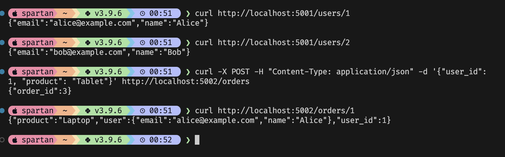

# CMPE 272 Assignment 1 - Microservices - Team 1

**Members:**

* Mohit Bandare
* Anupama Singh
* Pranav Trivedi
* Yashashav Devalapalli Kamalraj

---

## Overview

We built a **microservices-based system** with two services:

1. **User Service (`user_service.py`)**
   * Manages user data (name, email).
   * Supports:
     * `GET /users/<id>` → fetch user by ID.
     * `POST /users` → create a new user.
2. **Order Service (`order_service.py`)**
   * Manages orders (product, user association).
   * Integrates with the User Service to fetch full user details for each order.
   * Supports:
     * `GET /orders/<id>` → fetch order by ID (with embedded user info).
     * `POST /orders` → create a new order.

---

## How It Works

* **Step 1:** Run `user_service.py` on port `5001`.
* **Step 2:** Run `order_service.py` on port `5002`.
* **Step 3:** Use `curl` (or Postman) to test endpoints.

Example flow:

1. Requesting `/users/1` → returns Alice’s data.
2. Requesting `/orders/1` → returns Laptop order **plus Alice’s info** (fetched from User Service).
3. Posting to `/orders` with `{ "user_id": 1, "product": "Tablet" }` → creates a new order.

---

## Screenshots Reference

* **Screenshot 1:** Shows curl tests for both services:
  * Fetching users (Alice, Bob).
  * Creating a new order (Tablet for user 1).
  * Fetching an order with embedded user details.

* **Screenshot 2:** Shows both services running simultaneously in separate terminals (`user_service` on port 5001 and `order_service` on port 5002), handling requests successfully.
